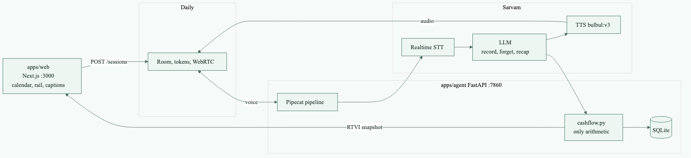

# Kubera



Voice agent that maps the next 30 days of someone’s money.

The model extracts facts. A deterministic engine (`apps/agent/cashflow.py`)
does every rupee of arithmetic and emits the calendar, rail, and payoff.
Sarvam only writes advice wording from that ledger.

| Path | Role |
|------|------|
| `apps/web` | Next.js call UI (Daily / Pipecat client) |
| `apps/agent` | Pipecat bot: Sarvam STT → LLM → TTS, FastAPI sessions |

## Prerequisites

- Docker + Docker Compose
- **or** Node 20+, Python 3.11+, [uv](https://docs.astral.sh/uv/)
- Keys: [Daily](https://dashboard.daily.co/) `DAILY_API_KEY`, [Sarvam](https://dashboard.sarvam.ai/) `SARVAM_API_KEY`

## Quick start

```bash
cp .env.example .env
# paste DAILY_API_KEY and SARVAM_API_KEY into .env
docker compose up --build
```

Then open **http://localhost:3000**

| URL | What |
|-----|------|
| http://localhost:3000 | Call UI |
| http://localhost:7860/health | Agent liveness |

`docker compose` waits until the agent is healthy before starting the web app.
Session rows live in a Docker volume (`KUBERA_DB_PATH=/data/kubera.db`), so a
rebuild does not wipe past calls.

## Environment

Copy `.env.example` → `.env` at the **repo root**. Compose loads that file into
the agent. Never commit `.env`.

| Variable | Required | Default | Used by |
|----------|----------|---------|---------|
| `DAILY_API_KEY` | yes | — | Agent: create rooms + tokens |
| `DAILY_API_URL` | no | `https://api.daily.co/v1` | Agent |
| `SARVAM_API_KEY` | yes | — | Agent: STT, LLM, TTS, advice rewrite, summaries |
| `AGENT_HOST` | no | `0.0.0.0` | Agent bind address |
| `AGENT_PORT` | no | `7860` | Agent bind port |
| `NEXT_PUBLIC_AGENT_URL` | web | `http://localhost:7860` | Browser → agent. Baked into the web image at build. |
| `NEXT_PUBLIC_SITE_URL` | no | unset | Absolute OG/Twitter URLs |
| `KUBERA_DB_PATH` | no | `apps/agent/data/kubera.db` | SQLite. Compose overrides to `/data/kubera.db`. |
| `SARVAM_LANGUAGE` | no | `en-IN` | STT + TTS language |
| `SARVAM_VOICE` | no | `rohan` | TTS voice |
| `SARVAM_TTS_MODEL` | no | `bulbul:v3` | TTS model |
| `SARVAM_LLM_MODEL` | no | `sarvam-105b-conversations` | Voice LLM. Must be a `/v1` model. |
| `SARVAM_SUMMARY_MODEL` | no | `sarvam-105b-conversations` | Summaries + advice rewrite. Must be `/v1`. |
| `SARVAM_TTS_TEMPERATURE` | no | `0.8` | TTS sampling |
| `DAILY_ROOM_TTL_SECS` | no | `3600` | Daily room + token lifetime |
| `PIPELINE_IDLE_SECS` | no | `120` | Hang up after silence |
| `BOT_JOIN_TIMEOUT_SECS` | no | `15` | Fail session create if bot never joins |
| `VAD_CONFIDENCE` | no | `0.7` | Silero on the aggregator (TTFB), not turn-taking |
| `VAD_START_SECS` | no | `0.1` | Speech start hang |
| `VAD_STOP_SECS` | no | `1.5` | Speech end hang |

`DAILY_ROOM_URL` and `DAILY_TOKEN` are set by the session worker at runtime.
Do not put them in `.env`.

Do not point `SARVAM_LLM_MODEL` or `SARVAM_SUMMARY_MODEL` at gemma4 / glm5.2 —
those need `/v2` and tool-calling plus summarization fail.

## Local development (no Docker)

Terminal 1 — agent:

```bash
cd apps/agent
uv sync --dev
uv run uvicorn server:app --host 0.0.0.0 --port 7860 --reload
```

Terminal 2 — web:

```bash
cd apps/web
npm install
NEXT_PUBLIC_AGENT_URL=http://localhost:7860 npm run dev
```

Dev server is http://localhost:3000 (or the next free port Next prints).

## Tests

```bash
cd apps/agent && uv sync --dev && uv run pytest
cd apps/web && npm test
```

Currently: **70** agent tests, **32** web tests.

Engine tests freeze `today` and assert day-by-day balances. The LLM never
computes those numbers.

## How a call works

1. Browser `POST /sessions` — agent creates a Daily room, starts the bot, returns URL + token.
2. Browser joins the room (Pipecat Daily transport).
3. Pipeline: Sarvam realtime STT → Sarvam LLM (`record` / `forget`) → Sarvam TTS.
4. After every write the engine projects 30 days from today and pushes a versioned snapshot over RTVI. The web only renders that snapshot.
5. Browser `DELETE /sessions/{id}` hangs up.

## What this build does not do

- No loans, credit lines, or investing suggestions (not in the planner vocabulary).
- Hindi-only speech is untested (`language_code` is locked to `en-IN`; Hinglish works).
- `/sessions` is unauthenticated (local demo).
- Demo video. Decision journal is `DECISION_JOURNAL.md`.
